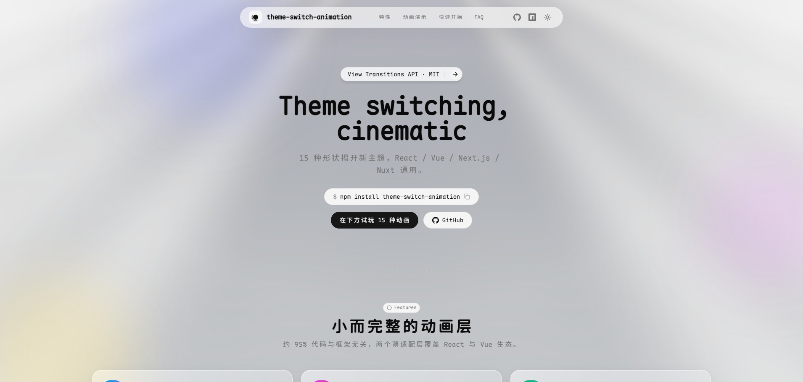

# 🌗 theme-switch-animation

[](https://www.npmjs.com/package/theme-switch-animation)
[](https://www.npmjs.com/package/theme-switch-animation)
[](https://bundlephobia.com/package/theme-switch-animation)
[](https://www.npmjs.com/package/theme-switch-animation)
[](https://github.com/baiwumm/theme-switch-animation/actions/workflows/ci.yml)
[](./LICENSE)

✨ 基于浏览器 View Transitions API 的主题切换动画库：切换 light / dark 主题时，新主题以指定形状（圆形扩散 / 多边形 / 百叶窗 / 方块格子 / 水滴涟漪 / 扇形扫开 等）"揭开"覆盖旧主题，而不是生硬跳变。

## 📸 预览



## ✨ 特性

- 🔀 **跨框架**：React 18+、Vue 3+、Next.js（App Router）、Nuxt 3+
- 🎨 **动画类型分族**：圆形扩散（含收起 / 模糊变体）、几何形状扩散、条带与格子（由 `direction` 控制四方向）、中线对开、环带前缘（由 `waveWidth` 控制波长）、角度扫开（由 `bladeCount` 控制扇叶数）。完整清单与逐个的观感说明见下方「🎬 动画类型」表
- 🔌 **受控模式**：不独占主题状态管理，`next-themes`、`@nuxtjs/color-mode` 用户可直接接入
- 🔄 **非受控多实例同步**：同页多个实例的 `isDark` 以 `<html>` 暗色类名为事实源镜像，其它标签页经 storage 事件同步
- 🛟 **自动降级**：不支持 View Transitions 或 `prefers-reduced-motion: reduce` 时自动降级为直接切换（状态永远正确）

## 📦 安装

```bash
pnpm add theme-switch-animation
# React / Vue / Next.js 从主入口导入；Nuxt 3+ 走模块（自动导入，无需 import）
```

## 🚀 快速开始

### ⚛️ React / Next.js（App Router 组件加 `'use client'`）

```tsx
import { useState } from 'react'
import { useThemeAnimation, ThemeAnimationType } from 'theme-switch-animation/react'

function ThemeButton() {
  // 非受控：库管理 localStorage + <html> class；多实例、跨标签页自动同步
  const { ref, toggleTheme, isDark, finished } = useThemeAnimation({
    animationType: ThemeAnimationType.CIRCLE,
    duration: 750,
    easing: 'ease-in-out',
  })
  const [animating, setAnimating] = useState(false)
  return (
    <button
      ref={ref}
      disabled={animating}
      onClick={async () => {
        setAnimating(true)
        toggleTheme()
        await finished // 动画期间禁用；降级时立即结算，不会 reject
        setAnimating(false)
      }}
    >
      {isDark ? '🌙' : '☀️'}
    </button>
  )
}
```

`finished` 是最近一次切换动画的结束 Promise（点击触发的那次渲染更新后读取到最新值）。

受控模式（接入 `next-themes` 等）：同时提供 `isDark` + `onChange`，库不碰 localStorage、不改 class——在转场回调内调用 `onChange(next)` 并等待外部系统真实写入 DOM（300ms 超时兜底，超时则跳过动画直切）后截图：

```tsx
const { resolvedTheme, setTheme } = useNextThemes()
const { ref, toggleTheme } = useThemeAnimation({
  isDark: resolvedTheme === 'dark',
  onChange: (next) => setTheme(next ? 'dark' : 'light'),
  animationType: ThemeAnimationType.CIRCLE_REVERT,
})
```

### 💚 Vue 3

```vue
<script setup lang="ts">
// useThemeAnimation / ThemeAnimationType 由包内导出；Nuxt 下由模块自动导入
const { triggerRef, toggleTheme, isDark, finished } = useThemeAnimation<HTMLButtonElement>({
  animationType: ThemeAnimationType.CIRCLE,
})
</script>

<template>
  <button ref="triggerRef" @click="toggleTheme">{{ isDark ? '🌙' : '☀️' }}</button>
</template>
```

受控模式下 options 需传**响应式来源**（`reactive()` 包装并以 `watchEffect` 同步外部状态）；传普通对象字面量会按 setup 时的快照工作。模式判定是动态的（computed）——先按非受控使用、后补上 `isDark` + `onChange` 转受控时，切换路径与返回值都会随最新模式走。

### 💚 Nuxt 3+

```ts
// nuxt.config.ts
export default defineNuxtConfig({
  modules: ['theme-switch-animation/nuxt'],
})
```

`useThemeAnimation` / `ThemeAnimationType` / `SKIP_TRANSITION` / `observeThemeClass` / `THEME_STORAGE_KEY` 全部自动导入，无需 import。

## 🎬 动画类型

| 类型 | 观感 | 起收点 | 消费的选项 |
| --- | --- | --- | --- |
| `CIRCLE` | 圆形扩散；`reverse` 可改为"新主题从四周显出、向触发点收拢" | 触发元素中心 | `reverse` |
| `CIRCLE_REVERT` | ⚠️ **已废弃**：等价于 `CIRCLE` + `reverse: 'auto'`（切暗扩散、切亮收起进触发点），计划在 0.5.0 移除 | 触发元素中心 | — |
| `CIRCLE_BLUR` | 边缘高斯模糊的圆形扩散 | 触发元素中心 | `blurAmount` |
| `SQUARE` / `DIAMOND` / `RECTANGLE` / `HEXAGON` / `TRIANGLE` / `STAR` | 多边形从触发点扩散（朝向见文档站画廊） | 触发元素中心 | — |
| `BLINDS` | 百叶窗：叶片逐条揭开 | 无触发点（全屏按叶宽平铺） | `direction` / `slatWidth` |
| `SCAN` | 硬边扫开 + 前缘半透明光束 | 无触发点（沿推进轴） | `direction` |
| `QR_GRID` | 方块格子逐格生长、末帧融为整屏 | 无触发点（按 `direction` 锚定方位） | `direction` |
| `RIPPLE` | 水滴涟漪：实心水面外推，前缘是主波峰 + 两圈衰减余波的环带 | 触发元素中心（波源） | `waveWidth` |
| `CLOCK_SWEEP` | 时钟扇形：扇形自 12 点顺时针扫开，前缘带 12° 软尾 | 触发元素中心（轴心） | — |
| `FAN` | 扇叶旋开：`bladeCount` 片楔形扇叶同时从轴心旋开，末帧拼成整屏；`reverse` 改为合拢 | 触发元素中心（轴心） | `bladeCount` / `reverse` |
| `CURTAIN` | 双开门：新主题自屏幕中线向两侧对称推开，起始帧中缝先透一道光 | 无触发点（全屏按中线对称） | — |

`BLINDS` / `SCAN` / `QR_GRID` / `CURTAIN` 是属性驱动蒙版（`@property --theme-switch-reveal` + 静止蒙版盒子），不读触发元素几何——`ref` 只用于点击与状态。`RIPPLE` / `CLOCK_SWEEP` / `FAN` 用同一机制但把轴心写进渐变串，因此消费 `ref` 几何；角度族另用 `--theme-switch-sweep`（`@property` 的 syntax 一经注册不可改，`<angle>` 不能与 `<length>` 同名）。`QR_GRID` 的"列 ∩ 行"双层蒙版交集经 `@supports (mask-composite: intersect)` 门控，不支持的引擎自动降级为推进轴单层条带（观感同百叶窗），状态始终正确。

## 🧩 API

### `useThemeAnimation(options)`

| 选项 | 类型 | 说明 |
| --- | --- | --- |
| `animationType` | `ThemeAnimationType` | 取上方「🎬 动画类型」表之一，默认 `CIRCLE` |
| `duration` | `number` | 动画时长 ms，默认 750 |
| `easing` | `string` | 任意合法 CSS timing-function，默认 `ease-in-out` |
| `blurAmount` | `number` | 模糊蒙版强度系数，默认 2。仅 `CIRCLE_BLUR` 生效 |
| `direction` | `'ltr' \| 'rtl' \| 'ttb' \| 'btt'` | 扫描方向，默认 `ltr`。仅 `BLINDS` / `SCAN` / `QR_GRID` 生效（可用 `ThemeAnimationDirection` 常量），非法值静默回落默认 |
| `slatWidth` | `number` | 百叶窗叶片宽度 px，范围 `[16, 200]`，默认 72。仅 `BLINDS` 生效，越界静默回落默认 |
| `waveWidth` | `number` | 涟漪波长 px（相邻两圈波峰间距），范围 `[8, 60]`，默认 18。仅 `RIPPLE` 生效，越界静默回落默认 |
| `bladeCount` | `number` | 扇叶数，范围 `[4, 16]` 的**整数**，默认 8。仅 `FAN` 生效，非整数或越界静默回落默认（非整数会让 `360 / bladeCount` 不整除，末帧留一条永不闭合的缝） |
| `reverse` | `boolean \| 'auto'` | 反向揭开，默认 `false`。`true` 恒反向；`'auto'` 切暗正向、切亮收起（即旧 `CIRCLE_REVERT` 的行为）。**与 `direction` 正交**：`direction` 决定推进轴，`reverse` 决定从内还是从外揭开。目前 `CIRCLE` 与 `FAN` 生效，其余类型静默忽略——形状族反向只能靠动 `mask-size`（会重新引入已修完的像素对齐抖动），`CURTAIN` 的软边在末帧会塌出一条居中半透明带，两者都做不到无副作用（见 `docs/animation-roadmap.md` §4），非法值静默回落 `false` |
| `darkClassName` | `string` | 暗色类名，默认 `dark`（与 next-themes / color-mode 默认一致） |
| `isDark` + `onChange` | — | 同时提供 → 受控模式；都缺省 → 非受控（localStorage key 为 `THEME_STORAGE_KEY` 常量 `theme-switch-animation`，`observeThemeClass` 可带自定义 key）；只提供其一 → 契约不完整（开发环境 console.warn，按非受控工作） |

返回值（React / Vue 形态一致，Vue 的 `isDark` / `finished` 是 Ref）：

| 字段 | 说明 |
| --- | --- |
| `ref` / `triggerRef` | 挂到触发元素；中心扩散类动画以该元素中心为圆心 |
| `toggleTheme` | 触发一次切换（内部走 `startViewTransition`） |
| `isDark` | 当前暗色状态；非受控多实例间自动同步 |
| `finished` | 最近一次切换动画的结束 Promise；库内已消化 rejection，快速连点不产生 unhandledrejection |

### 底层与自定义集成（`theme-switch-animation` 主入口）

- `runThemeTransition(params)`：编排一次转场。`domUpdate` 返回 `SKIP_TRANSITION` 表示"新截图尚未就绪"，浏览器立即 `skipTransition()` 跳过转场（受控模式超时、自定义外部系统等待的推荐写法）；`nextIsDark` 显式传目标状态，`CIRCLE_REVERT` 的方向感知不再依赖从 `<html>` class 反推（`data-theme` 型外部系统也可用）。
- `observeThemeClass(doc, className, onChange)`：以 `<html>` 暗色类名为事实源的观察器（MutationObserver + storage 跨标签页同步），返回停止函数。非受控多实例同步即基于它；页面级"全局主题指示器"等场景可直接复用。
- `waitForThemeSync(params)`：受控模式的等待协议（300ms 超时，`THEME_SYNC_TIMEOUT_MS`）。
- `supportsViewTransition()` / `prefersReducedMotion()` / `shouldSkipTransition()`：降级判定。
- 蒙版几何与样式构建（`getMaskGeometry` / `buildAnimationCSS` 等）亦从主入口公开导出，自定义动画 / SSR 预注入等场景可用。

## ⚠️ 从 0.1.x 升级（0.2.0 破坏性变更）

0.2.0 把"四个方向"从**动画类型**降级为**普通选项** `direction`，并新增三种条带 / 格子类动画。

**移除**：`ThemeAnimationType.LTR / RTL / TTB / BTT` 四个类型值，`DirectionalAnimationType` 类型，以及 `BAR_MASK_IMAGE` / `BAR_START_PX` / `getDirectionalMaskGeometry` / `isDirectionalAnimationType` 四个导出。

**迁移**：原四向擦除 → `SCAN` + `direction`。

```tsx
// 0.1.x
useThemeAnimation({ animationType: ThemeAnimationType.RTL })

// 0.2.0
useThemeAnimation({
  animationType: ThemeAnimationType.SCAN,
  direction: ThemeAnimationDirection.RTL, // 或字符串 'rtl'
})
```

观感差异只有一处：`SCAN` 的揭开前缘多了一条 12px 半透明光束带（带宽与透明度是导出常量 `SCAN_BAND_WIDTH_PX` / `SCAN_BAND_ALPHA`，未开放为选项）。除此之外逐帧扫开效果与原四向类型一致。

**新增**：`BLINDS`（`slatWidth` 控叶宽 16–200px，默认 72）、`SCAN`、`QR_GRID`（方块格子，格距 `QR_GRID_CELL_PX` = 64）三种类型；`direction` / `slatWidth` 两个选项；`ThemeAnimationDirection` 常量与同名类型（`.` / `./react` / `./vue` / `./nuxt` 四个入口均可用，Nuxt 侧自动导入含同名类型别名）。

`direction` 对未消费它的类型（`CIRCLE` 家族与形状家族）静默无效，这些类型的行为与 0.1.x 完全一致。

## ✅ 行为契约

- **降级**：不支持 View Transitions（Safari < 18、Firefox < 144 等）、`prefers-reduced-motion: reduce`、SSR 渲染阶段——均直接切换，状态照常正确。
- **受控超时**：外部系统 300ms 内未把 DOM 同步到位时跳过动画直切，不播放"旧→旧"的空转动画；超时结算前会复查一次目标状态。
- **iframe / 多文档**：转场样式清理按 document 记账，互不干扰。
- **Vue 转场路线**：`startViewTransition` 回调内 `await nextTick()`，截图前 DOM 已更新。

## 📄 License

[MIT](./LICENSE)
